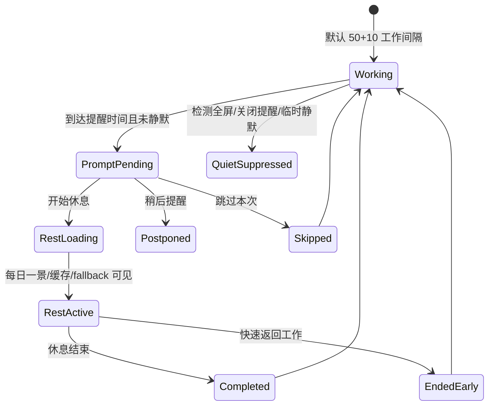
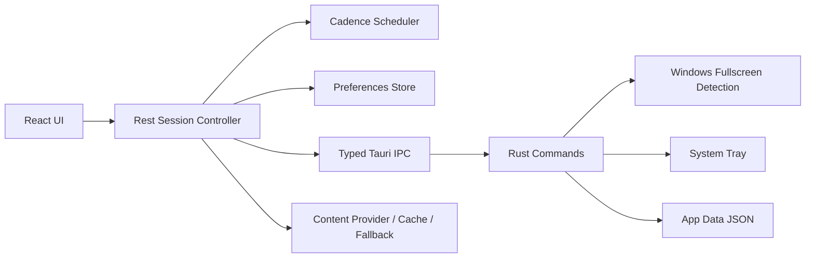

# Venus

Venus 是一个 Windows-first 的桌面休息空间应用。它不是健康打卡工具，也不是番茄钟仪表盘；第一版目标是把工作间隔后的短暂休息做成一个轻、静、美的个人空间。

当前 MVP 使用 Tauri 2 + React + TypeScript + Vite 构建。Rust/Tauri 负责桌面集成、窗口能力、全屏检测、系统托盘和本地持久化；TypeScript/React 负责休息节奏、会话状态、偏好、内容编排和界面体验。

## 当前状态

- 已完成 Spec Kit 基础设施、项目宪章、产品规格、技术计划、任务拆分和设计方向文档。
- 已完成应用基础脚手架：Tauri、React、TypeScript、Vite、Vitest、Playwright。
- 已完成 US1 核心能力：默认 50+10 节奏、温和提醒、稍后、跳过、偏好回退、全屏静默检测、系统托盘事件骨架和自动化验证。
- 下一阶段重点是 US2：全屏美感休息空间、每日一景、在线内容源、本地缓存和 bundled fallback。

## 产品方向

Venus MVP 的默认设计方向是“沉浸式自然感 + 桌面级克制交互”。用户接受休息提醒后，应进入一个低打扰、视觉完成度高、控制项克制的休息空间。



图片占位：后续可在这里放置 Venus 休息空间截图。

```text
docs/images/venus-rest-space-placeholder.png
```

## 技术架构



主要目录：

- `src/app/`: React 应用入口和全局样式。
- `src/features/rest-space/`: 休息空间的 cadence、session、preferences、desktop、content、audio 和组件。
- `src/shared/`: 事件、时间、性能标记等共享能力。
- `src-tauri/`: Tauri/Rust 桌面集成。
- `public/moments/`: 打包 fallback 内容目录。
- `specs/001-beautiful-rest-space/`: Spec Kit 规格、计划、任务和验证文档。

## 环境要求

- Windows 10/11。
- Node.js LTS。
- Rust stable toolchain。
- Tauri 2 所需 Windows 开发依赖和 WebView2 Runtime。
- Playwright 浏览器依赖，用于 e2e 测试。

如果当前 PowerShell 找不到 `cargo`，可临时补 PATH：

```powershell
$env:PATH = "$env:USERPROFILE\.cargo\bin;$env:PATH"
```

首次运行 Playwright e2e 前安装浏览器：

```powershell
npx playwright install chromium
```

## 安装与运行

```powershell
npm install
npm run dev
```

浏览器访问：

```text
http://127.0.0.1:1420
```

运行 Tauri 桌面应用：

```powershell
npm run tauri:dev
```

构建前端产物：

```powershell
npm run build
```

## 验证命令

```powershell
cargo test --manifest-path src-tauri/Cargo.toml
npm test
npm run test:e2e
npm run build
```

当前已验证通过的范围：

- Rust/Tauri 编译测试。
- Vitest unit/integration 测试。
- Playwright US1 prompt journey 和 1 秒反馈性能测试。
- TypeScript + Vite production build。

## Spec Kit 文档入口

- [项目宪章](.specify/memory/constitution.md)
- [功能规格](specs/001-beautiful-rest-space/spec.md)
- [技术计划](specs/001-beautiful-rest-space/plan.md)
- [设计方向](specs/001-beautiful-rest-space/design-direction.md)
- [任务清单](specs/001-beautiful-rest-space/tasks.md)
- [验证指南](specs/001-beautiful-rest-space/quickstart.md)

## Git 状态说明

当前主线分支为 `main`。开发过程按 Spec Kit 任务推进，完成一个稳定切片后提交并推送。