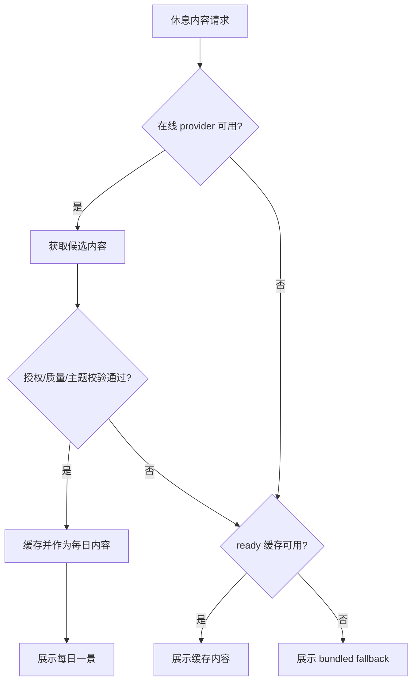

# Venus 内容来源与授权边界

本文记录 Venus MVP 的视觉、音频、缓存和 fallback 策略。目标是在不依赖私密凭证的前提下，提供稳定、可审查、可替换的休息内容来源。

## 当前来源

### 在线视觉内容

- 默认 provider: Wikimedia Commons。
- 访问方式: 浏览器端调用 Wikimedia Commons API，使用公开接口与 CORS，不需要私有 API key。
- 主题范围: forest、lake、meadow、mountain、ocean、rain、sky、stars。
- 候选内容必须包含来源、授权说明、作者或来源署名、分辨率、主题和匹配标签。
- 候选内容未通过授权、分辨率、主题或媒体类型校验时，必须被拒绝，不得进入每日内容。

### 本地视觉 fallback

- 默认 fallback manifest: `public/moments/fallback.json`。
- 当前 fallback 资源由 Venus 本地生成，可随应用打包。
- fallback 必须保持完整体验质量，不允许使用开发占位图、错误提示图或临时素材。
- 替换 fallback 时，必须同步更新 manifest 中的 title、theme、mood、尺寸、licenseNote 和 attribution。

### 音频内容

- US3 第一版默认使用 Venus generated bundled soundscape。
- 音频不依赖在线请求即可完成播放、静音、音量调整和退出淡出。
- 在线音频只通过 AudioProvider 接口预留。
- 后续无 key 实验源优先 Wikimedia Commons Audio。
- Freesound 等需要 token 的来源只能通过 proxy/serverless 接入，不得在桌面端硬编码 token。

## 授权与署名规则

- 每个在线候选必须保留 provider、providerAssetId、licenseNote 和 attribution。
- licenseNote 为空、来源不可追溯或媒体类型不符合预期时，候选必须被拒绝。
- attribution 应优先使用作者信息；缺失时可使用 provider 提供的 credit 或贡献者说明。
- 文档、测试记录或 release smoke 中引用的内容 URL 应仅用于审查，不应写入任何私密凭证。

## 缓存策略

- 在线候选通过校验后才允许进入缓存流程。
- ready 且未过期的缓存条目可优先用于休息空间。
- 过期缓存可被清理，但带有 fallbackId 的条目必须保留 fallback 关联，避免离线体验断裂。
- 缓存失败、网络失败、provider 超时或授权缺失都必须作为可恢复状态处理。
- 缓存不可用时，体验必须降级到 ready 缓存或 bundled fallback，不得显示空白页或错误堆栈。

## 禁止事项

- 不得在桌面端硬编码私密 API key、OAuth token、session token 或供应商密钥。
- 不得缓存、记录或上传用户窗口标题、会议内容、文档正文或其他工作内容。
- 不得使用授权不明、署名缺失或质量不足的在线内容作为默认每日内容。
- 不得把 fallback 做成开发提示、灰色占位、错误页或功能说明页。
- 不得为了匹配音频强行组合情绪冲突的视觉和声音；无法匹配时优先无声继续。

## 替换与扩展流程

1. 新增 provider 前，先定义可恢复错误、超时策略和授权字段映射。
2. 为授权缺失、分辨率不足、主题不匹配、限流和超时补充最窄测试。
3. 确认 provider 不需要桌面端私密凭证。
4. 更新 `public/moments/fallback.json` 或 provider mapping 时，同步更新 quickstart 验收记录。
5. release 前运行 unit、integration、e2e、Tauri build 和 release smoke。