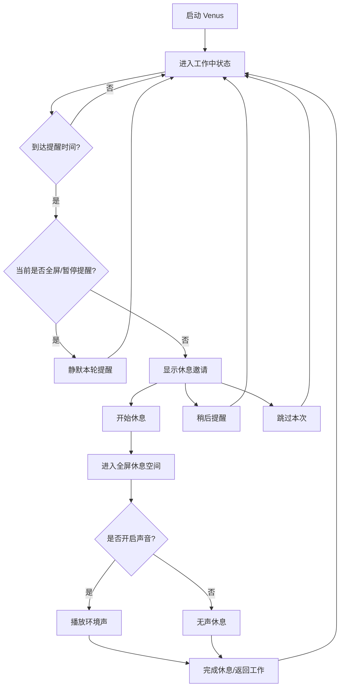

# Venus MVP 使用文档

Venus 是一个 Windows-first 的桌面休息空间应用。它用温和提醒、全屏自然画面和可选环境声，把工作间隔后的短暂休息变成一个轻、静、美的个人空间。

Venus 不是医疗建议工具、健康打卡工具或效率管理仪表盘。它的第一版目标很简单：在合适的时候邀请你离开工作界面片刻，并让这段休息足够安静、好看、容易退出。

图片占位：后续可补充 Venus 主界面、休息邀请、全屏休息空间和声音控制截图。

```text
docs/images/user-guide-home.png
docs/images/user-guide-prompt.png
docs/images/user-guide-rest-space.png
docs/images/user-guide-audio-controls.png
```

## MVP 功能概览

### 默认 50+10 休息节奏

- 默认使用 50 分钟工作 + 10 分钟休息。
- 到达提醒时间后，Venus 会显示一个克制的休息邀请。
- 你可以选择开始休息、稍后提醒或跳过本次。
- 偏好会保存在本机；偏好损坏时会安全回退到默认值。

### 温和休息邀请

- 提醒文案保持短句和低压力表达。
- 接受、稍后、跳过等操作会在 1 秒内给出可感知反馈。
- 连续工作时不需要先配置复杂规则即可体验完整流程。

### 全屏美感休息空间

- 接受休息后进入全屏或沉浸窗口。
- 休息空间以每日一景为主体，控制项保持低存在感。
- 网络可用时，Venus 会尝试从 Wikimedia Commons 获取合法可用的自然视觉内容。
- 网络失败、内容不合格或缓存不可用时，会使用本地 bundled fallback，不显示空白页或错误堆栈。
- 在休息空间中按 `Space` 可以切换同一批候选画面。

### 可选白噪音与环境声

- 休息空间默认不强制播放声音。
- 点击“开启声音”后，会播放与当前视觉主题匹配的本地 bundled soundscape。
- 支持音量调节、静音和恢复声音。
- 结束休息或返回工作时，声音会淡出并停止。
- 音频设备不可用时，Venus 会提示“声音暂时不可用”，你仍然可以继续无声休息。

### 全屏静默

- 当系统检测到你正在全屏工作、演示或观看内容时，Venus 会自动静默本轮提醒。
- 静默检测不读取窗口标题、会议内容或文档正文。
- 退出全屏后，Venus 会恢复正常提醒能力。

### 系统托盘

- Venus 提供系统托盘入口。
- 可从托盘开始休息、暂停提醒或恢复提醒。
- 适合不想等待完整工作间隔时快速进入休息空间。

### Release 安装包

- 当前 MVP 已支持 Windows 安装包构建。
- GitHub Release `v0.1.0` 已生成 MSI 和 NSIS exe 安装包。
- 日常 `main` push 会生成 Actions artifact；`v*` tag 会正式创建 GitHub Release。

## 基本使用流程



## 安装与启动

### 从 GitHub Release 安装

1. 打开 Venus 仓库的 Releases 页面。
2. 选择 `v0.1.0`。
3. 下载以下任一安装包：
   - `Venus_0.1.0_x64_en-US.msi`
   - `Venus_0.1.0_x64-setup.exe`
4. 按 Windows 安装流程完成安装。
5. 启动 Venus。

### 从源码运行

适合开发、验证或调试。

```powershell
npm install
npm run tauri:dev
```

只启动前端开发服务器：

```powershell
npm run dev
```

构建 release 安装包：

```powershell
npm run tauri:build
```

生成的本地安装包位于：

```text
src-tauri/target/release/bundle/msi/Venus_0.1.0_x64_en-US.msi
src-tauri/target/release/bundle/nsis/Venus_0.1.0_x64-setup.exe
```

## 使用休息邀请

启动 Venus 后，默认进入工作中状态。到达工作间隔后，Venus 会显示休息邀请。

你可以选择：

- **开始休息**：进入全屏休息空间。
- **稍后提醒**：暂时收起提醒，稍后再次出现。
- **跳过本次**：本工作间隔不再重复提醒。

如果你正在全屏演示、视频播放或专注场景中，Venus 会静默本轮提醒。

## 使用休息空间

进入休息空间后，你会看到每日一景或本地 fallback 画面。

常用操作：

- 按 `Space`：切换候选画面。
- 点击“开启声音”：播放环境声。
- 点击“静音”或“恢复声音”：控制声音状态。
- 拖动音量滑块：调整播放音量。
- 点击“完成休息”：结束本次休息。
- 点击“返回工作”：提前退出休息空间。

控制项默认保持低存在感；移动鼠标、键盘操作、状态变化或临近结束时会更明显地出现。

## 内容来源与离线体验

Venus MVP 的在线视觉内容来自 Wikimedia Commons。在线候选内容必须包含来源、授权说明、作者或来源署名、分辨率和主题信息。

内容选择顺序：

1. 优先使用通过授权和质量校验的在线候选。
2. 在线内容可用后写入本地缓存。
3. 网络失败或在线内容不合格时使用 ready 缓存。
4. 缓存也不可用时使用本地 bundled fallback。

音频第一版使用 Venus 本地 generated bundled soundscape，不依赖在线音频服务。

更多内容来源细节见 [content-sources.md](content-sources.md)。

## 隐私与安全边界

Venus MVP 遵循本地优先和最小采集原则：

- 不需要账号。
- 不上传工作内容。
- 不读取或记录窗口标题。
- 不采集会议内容、文档正文或输入内容。
- 不在桌面端硬编码私密 API key。
- 全屏静默只判断前台窗口是否覆盖显示器，不读取窗口文本。

## 常见问题

### 为什么没有马上出现休息提醒？

默认工作间隔是 50 分钟。开发验证时可以使用调试入口或托盘“开始休息”快速进入休息空间。

### 为什么全屏时没有弹出提醒？

这是预期行为。Venus 会在检测到全屏工作、演示或视频场景时静默本轮提醒，避免遮挡当前内容。

### 没有网络时还能用吗？

可以。Venus 会优先使用缓存内容；缓存不可用时使用本地 fallback 画面。声音第一版使用本地 bundled soundscape，不依赖网络。

### 声音为什么默认不播放？

浏览器和桌面 WebView 通常要求用户先进行明确操作才播放声音。Venus 也刻意保持声音可选，避免休息空间突然发声。

### 安装包在哪里下载？

正式版本在 GitHub Releases 页面下载。当前 MVP release 为 `v0.1.0`，包含 `.msi` 和 `.exe` 安装包。

## 当前限制

- MVP 暂不提供复杂内容库浏览。
- MVP 暂不提供账号、云同步、团队管理或健康统计。
- 在线视觉 provider 当前以 Wikimedia Commons 为主。
- 在线音频 provider 仅预留接口，默认使用本地 bundled soundscape。
- 智能节奏建议尚未作为用户可配置能力开放。

## 相关文档

- [内容来源与授权边界](content-sources.md)
- [用户可见文案原则](ux-language.md)
- [MVP 验证指南](../specs/001-beautiful-rest-space/quickstart.md)
- [功能规格](../specs/001-beautiful-rest-space/spec.md)
- [设计方向](../specs/001-beautiful-rest-space/design-direction.md)