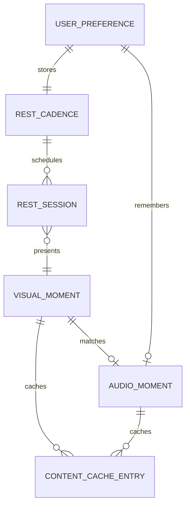

# Data Model: 美好休息空间 MVP

## Entity: Rest Cadence

**Purpose**: 描述 Venus 何时邀请用户休息，以及用户对提醒节奏的基本偏好。

**Fields**:

- `id`: 固定本地配置标识，MVP 可为 `default`。
- `workDurationMinutes`: 工作间隔，默认 50，允许后续扩展智能建议。
- `restDurationMinutes`: 休息时长，默认 10。
- `postponeMinutes`: 稍后提醒间隔，MVP 默认 5，可配置但不在主流程中突出。
- `promptsEnabled`: 是否启用提醒。
- `temporaryQuietUntil`: 临时静默结束时间，可为空。
- `suggestionMode`: `fixed` 或 `suggested`，MVP 默认为 `fixed`，为未来智能建议保留。

**Validation Rules**:

- `workDurationMinutes` 必须大于 0；MVP 推荐范围 15-120。
- `restDurationMinutes` 必须大于 0；MVP 推荐范围 1-30。
- `postponeMinutes` 必须大于 0 且小于当前工作间隔。
- 关闭 `promptsEnabled` 时不得继续弹出 rest prompt。

**Relationships**:

- 被 `Rest Session` 使用来计算下一次 prompt。
- 被 `User Preference` 持久化。

## Entity: Rest Session

**Purpose**: 描述一次从工作间隔、提醒、休息到返回工作的用户尝试。

**Fields**:

- `id`: 本地生成的会话 ID。
- `createdAt`: 会话创建时间。
- `promptedAt`: 提醒出现时间，可为空。
- `startedAt`: 用户接受并进入休息空间的时间，可为空。
- `endedAt`: 会话结束时间，可为空。
- `state`: `idle`、`working`、`promptPending`、`postponed`、`skipped`、`restLoading`、`restActive`、`restCompleting`、`completed`、`endedEarly`、`quietSuppressed`。
- `stage`: `enteringRest`、`settling`、`returningToWork`，未进入休息时为空。
- `selectedAction`: `accept`、`postpone`、`skip`、`end`、`autoSuppress`，可为空。
- `quietReason`: `fullscreenDetected`、`temporaryQuiet`、`promptsDisabled`，可为空。
- `contentId`: 当前 Visual Moment ID，可为空。
- `audioId`: 当前 Audio Moment ID，可为空。

**Validation Rules**:

- `restActive` 必须有 `startedAt` 和 `contentId`。
- `skipped` 必须有 `selectedAction = skip`。
- `quietSuppressed` 必须有 `quietReason`。
- `completed` 或 `endedEarly` 必须停止或淡出音频。

**State Transitions**:

- `working -> promptPending`: 到达默认或配置的工作间隔，且未处于静默。
- `working -> quietSuppressed`: 检测到全屏、临时静默或关闭提醒。
- `promptPending -> restLoading`: 用户接受休息。
- `promptPending -> postponed`: 用户选择稍后。
- `promptPending -> skipped`: 用户跳过本次休息。
- `postponed -> promptPending`: 到达稍后提醒时间，且未处于静默。
- `restLoading -> restActive`: 内容或 fallback 在 2 秒预算内可见。
- `restActive -> restCompleting -> completed`: 到达休息结束或用户完成。
- `restActive -> endedEarly`: 用户快速返回工作。

## Entity: Visual Moment

**Purpose**: 描述每日一景、在线候选、缓存内容或 fallback 的视觉内容。

**Fields**:

- `id`: 内容标识。
- `dateKey`: 日期键，用于每日选择。
- `title`: 短标题，语言保持轻、静、美。
- `theme`: 如 `forest`、`coast`、`mountain`、`rain`、`sky`。
- `category`: `landscape`、`abstractCalm`、`fallback`。
- `sourceType`: `online`、`cache`、`bundledFallback`。
- `provider`: 在线内容提供方标识；本地 fallback 可为 `local`。
- `providerAssetId`: 提供方资源标识，可为空。
- `imageSrc`: 缓存、本地或打包资源路径；在线候选在使用前必须落为可缓存地址或本地缓存路径。
- `remoteUrl`: 在线资源地址，可为空。
- `dominantTone`: `cool`、`warm`、`neutral`、`dark`、`bright`。
- `availability`: `ready`、`loading`、`unavailable`。
- `licenseNote`: 素材授权和来源说明。
- `attribution`: 对外展示或内部记录的作者/来源信息。
- `cachedAt`: 缓存时间，可为空。
- `expiresAt`: 缓存过期时间，可为空。
- `fallbackId`: 对应 fallback 内容 ID。

**Validation Rules**:

- 默认 daily visual 必须有合法素材来源、授权说明和明确 fallback。
- `sourceType = online` 的内容必须在进入休息前缓存成功，或降级为 `bundledFallback`。
- `availability = unavailable` 时 UI 必须展示 polished fallback，不能空白或暴露错误堆栈。
- `theme` 应能与 Audio Moment 匹配。

## Entity: Audio Moment

**Purpose**: 描述与视觉主题匹配的在线、缓存或 fallback 白噪音/环境声。

**Fields**:

- `id`: 音频标识。
- `matchedVisualThemes`: 可匹配的 visual themes。
- `title`: 声音名称。
- `soundType`: `rain`、`forest`、`waves`、`wind`、`stream`、`silenceFallback`。
- `sourceType`: `online`、`cache`、`bundledFallback`、`silenceFallback`。
- `provider`: 在线内容提供方标识；本地 fallback 可为 `local`。
- `providerAssetId`: 提供方资源标识，可为空。
- `audioSrc`: 缓存、本地或打包资源路径，可为空。
- `remoteUrl`: 在线资源地址，可为空。
- `playbackState`: `off`、`loading`、`playing`、`muted`、`unavailable`、`fadingOut`。
- `volume`: 0-100。
- `intensity`: 0-100。
- `licenseNote`: 素材授权和来源说明。
- `attribution`: 对外展示或内部记录的作者/来源信息。
- `cachedAt`: 缓存时间，可为空。
- `expiresAt`: 缓存过期时间，可为空。

**Validation Rules**:

- 音频默认可选，不得自动制造突兀播放。
- `sourceType = online` 的音频必须在播放前缓存成功，或降级为 `silenceFallback` / `bundledFallback`。
- 音量或强度变化必须平滑。
- 休息结束、跳过或提前退出时必须停止或淡出。
- `unavailable` 时休息空间仍可无声继续。

## Entity: User Preference

**Purpose**: 保存轻量个人选择，让 MVP 不需要账户也能记住体验偏好。

**Fields**:

- `cadence`: Rest Cadence 当前配置。
- `audioEnabledByDefault`: 是否默认开启声音。
- `lastVolume`: 最近音量。
- `promptStyle`: MVP 固定为 `gentle`，为未来样式保留。
- `quietMode`: `off`、`untilNextInterval`、`untilTime`。
- `lastCompletedSessionAt`: 最近完成休息时间，可为空。
- `schemaVersion`: 偏好文件版本。

**Validation Rules**:

- 读取失败时必须回退到默认偏好，并保留用户可继续使用的状态。
- 写入失败时需要克制提示，但不能阻塞当前休息流程。
- 迁移时按 `schemaVersion` 处理，未知版本使用默认值并记录可诊断错误。

## Entity: Content Cache Entry

**Purpose**: 描述在线视觉/音频内容的本地缓存状态，保证休息空间可在离线或 provider 失败时快速打开。

**Fields**:

- `id`: 缓存项 ID。
- `momentId`: 对应 Visual Moment 或 Audio Moment ID。
- `assetType`: `visual` 或 `audio`。
- `sourceProvider`: 内容提供方标识。
- `localPath`: 本地缓存路径。
- `remoteUrl`: 原始在线资源地址。
- `licenseNote`: 缓存时记录的授权说明。
- `attribution`: 作者/来源信息。
- `cachedAt`: 缓存时间。
- `expiresAt`: 过期时间，可为空。
- `status`: `ready`、`expired`、`failed`。

**Validation Rules**:

- `ready` 状态必须有可读 `localPath` 和授权/来源记录。
- `expired` 或 `failed` 不得阻塞休息空间打开，必须允许 fallback。
- 清理缓存不得删除打包 fallback。

## Entity Relationship

