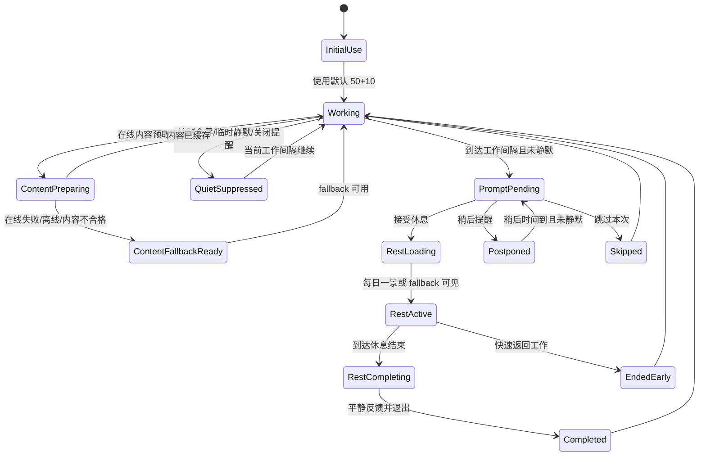
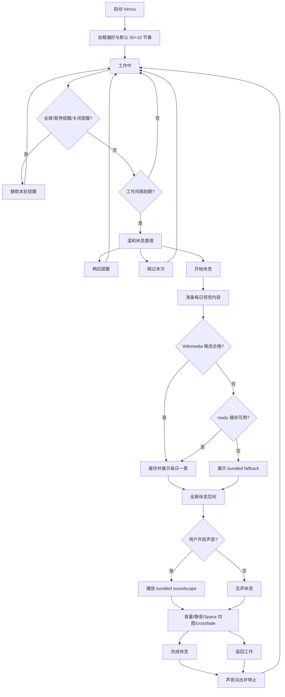

# Quickstart: 美好休息空间 MVP 验证指南

本指南用于在 implementation 阶段验证 Venus MVP 是否满足 spec、plan、数据模型和本地契约。当前阶段不包含完整实现代码；命令会在项目脚手架生成后作为验收基线使用。

## 前置条件

- Windows 10/11 桌面环境。
- Node.js LTS、pnpm 或 npm。
- Rust stable toolchain。
- Tauri 2.x 开发依赖与 Windows WebView2 Runtime。
- 可用耳机或扬声器，用于验证音频状态。
- 至少一个可全屏的应用，用于手动验证全屏静默。
- 可用网络连接，用于验证在线内容源；也需要能断网，用于验证缓存和本地 fallback。

## 推荐开发命令

```powershell
pnpm install
pnpm tauri dev
pnpm test:unit
pnpm test:integration
pnpm test:e2e
cargo test --manifest-path src-tauri/Cargo.toml
```

若 implementation 阶段选择 npm，等价命令为 `npm install`、`npm run tauri:dev`、`npm run test:unit`、`npm run test:integration`、`npm run test:e2e`。

## 核心状态流



## 场景验证

### P1: 分阶段休息邀请

1. 启动应用并使用默认 50 分钟工作 + 10 分钟休息配置。
2. 在测试环境使用 fake timer 或调试开关模拟工作间隔到期。
3. 预期：prompt 以安静、清晰、非惊扰方式出现；接受、稍后、跳过都可在一次明确操作内完成。
4. 选择“稍后提醒”。
5. 预期：prompt 收起，并在 `postponeMinutes` 到达后再次出现。
6. 选择“跳过”。
7. 预期：本工作间隔不再重复打扰，会话状态为 `skipped`。

#### P1 自动化命令

```powershell
npm run test:unit -- src/test/unit/rest-space/cadence-scheduler.test.ts src/test/unit/rest-space/session-state.test.ts
npm run test:integration -- src/test/integration/preferences.persistence.test.ts src/test/integration/desktop-quiet-context.test.ts
npm run build
cargo test --manifest-path src-tauri/Cargo.toml
```

#### P1 手动验收记录

| 检查项 | 记录 |
| --- | --- |
| Windows 版本 |  |
| 显示器数量与缩放比例 |  |
| Venus 启动方式 | `npm run tauri:dev` / release build |
| 默认节奏 | 50 分钟工作 + 10 分钟休息 |
| Prompt 出现方式 |  |
| 接受休息反馈是否 1 秒内可感知 |  |
| 稍后提醒反馈是否 1 秒内可感知 |  |
| 跳过本次反馈是否 1 秒内可感知 |  |
| 全屏应用名称 |  |
| 全屏静默是否未遮挡工作内容 |  |
| `quietSuppressed` reason | `fullscreenDetected` / `temporaryQuiet` / `promptsDisabled` |
| 托盘开始休息事件 |  |
| 托盘暂停/恢复提醒事件 |  |
| 备注 |  |

### P2: 全屏美感休息空间

#### P2 快速测试入口

开发验证时不需要等待完整工作节奏。启动应用后可使用以下任一入口：

- 托盘菜单：右键 Venus 托盘图标，选择“开始休息”。
- 在线图调试入口：打开 `http://127.0.0.1:1420/?venusE2E=rest&venusProvider=online`，直接请求 Wikimedia Commons 并进入休息空间。
- 本地 fallback 调试入口：打开 `http://127.0.0.1:1420/?venusE2E=rest&venusProvider=fallback`，直接进入离线 fallback 休息空间。
- Prompt 调试入口：打开 `http://127.0.0.1:1420/?venusE2E=prompt&venusProvider=online`，先显示休息提示，再点击“开始休息”。

当前推荐的首个在线 provider 是 Wikimedia Commons：无需私有 API key，支持 CORS，且能返回授权、作者和分辨率元数据。进入在线图休息空间后，按 Space 可切换同一批候选图片；图片切换应使用上一张淡出、下一张淡入的 crossfade，且图片本身保持非常缓慢的呼吸式缩放/平移。切换过程中不应出现空白闪屏、布局跳动或明显眩目的运动；系统开启 `prefers-reduced-motion` 时应降级为静态图。

#### P2 场景步骤

1. 在有网络环境下启动应用，触发当日内容准备。
2. 预期：在线视觉/音频候选通过授权、主题和质量校验后被缓存。
3. 在 prompt 中选择开始休息。
4. 预期：进入全屏或沉浸窗口，2 秒内显示缓存的每日一景或 polished fallback。
5. 模拟在线 provider 超时、限流、返回缺少授权说明或视觉/音频不匹配。
6. 预期：拒绝不合格内容，显示最近缓存或风格一致的本地 fallback，不出现空白、错误堆栈或突兀占位。
7. 断开网络后再次进入休息空间。
8. 预期：2 秒内显示缓存或本地 fallback，用户无需理解网络状态即可继续休息。
9. 等待休息结束或点击快速返回。
10. 预期：应用给出简短、平静的返回反馈，并退出全屏/沉浸窗口。

#### P2 自动化命令

```powershell
npm run test:unit -- src/test/unit/rest-space/content-provider.test.ts src/test/unit/rest-space/daily-moment-selector.test.ts src/test/unit/rest-space/cache-index.test.ts
npm run test:integration -- src/test/integration/content-cache.test.ts src/test/integration/window-fullscreen.test.ts
npm run test:e2e -- src/test/e2e/us2-rest-space.spec.ts src/test/e2e/us2-rest-space-performance.spec.ts
npm run build
cargo test --manifest-path src-tauri/Cargo.toml
```

#### P2 内容来源验收记录

| 检查项 | 记录 |
| --- | --- |
| 在线 provider 名称 |  |
| provider 查询主题 | forest / lake / meadow / mountain / ocean / rain / sky / stars |
| 候选内容来源 URL |  |
| 授权说明 `licenseNote` |  |
| 作者/来源 `attribution` |  |
| 分辨率 |  |
| 主题与情绪 |  |
| 视觉/音频匹配说明 |  |
| 缓存本地路径 |  |
| 缓存命中结果 |  |
| 断网 fallback 结果 |  |
| 2 秒内是否可见 |  |
| 被拒绝候选原因 | `license_missing` / `resolution_too_low` / `theme_mismatch` / `rate_limited` / `provider_timeout` |

#### P2 手动场景

1. 在联网状态下准备一组合法候选内容。
2. 预期：候选内容必须包含 provider、资源标识、授权说明、来源/作者、主题、质量和匹配标签。
3. 将同一内容写入缓存后重新进入休息空间。
4. 预期：缓存命中时无需等待在线 provider，休息空间仍在 2 秒内显示完整画面。
5. 断开网络或模拟 provider timeout/rate limit。
6. 预期：系统拒绝不合格在线结果，优先使用 ready 缓存；缓存不可用时使用 `public/moments/fallback.json` 中的 bundled fallback。
7. 清空或破坏在线候选授权说明。
8. 预期：候选被拒绝，原因记录为 `license_missing`，不得进入默认每日内容。

### P3: 白噪音与音频控制

#### P3 音频策略

US3 第一版使用本地 generated bundled soundscape，不依赖在线音频请求即可完成稳定播放、静音、音量和退出淡出。在线音频 provider 只通过 `AudioProvider` 接口预留：无 key 实验源优先 Wikimedia Commons Audio；Freesound 仅允许通过 proxy/serverless 接入，不得在桌面端硬编码 token。

图片主题与声音大类映射：

| 图片主题 | 声音大类 |
| --- | --- |
| forest / meadow | forest |
| lake / ocean | water |
| rain | rain |
| mountain / sky | air |
| stars | night |

Space 切图时，同类声音大类保持当前音频；跨类声音大类延迟约 1 秒后 crossfade。完成休息或返回工作时，声音应淡出并停止，不得残留播放。

#### P3 自动化命令

```powershell
npm run test:unit -- src/test/unit/rest-space/audio-state.test.ts src/test/unit/rest-space/audio-matching.test.ts
npm run test:integration -- src/test/integration/audio-device.test.ts
npm run test:e2e -- src/test/e2e/us3-audio-controls.spec.ts src/test/e2e/us3-audio-performance.spec.ts
npm run build
```

#### P3 手动场景

1. 进入休息空间，确认默认不自动播放声音。
2. 点击“开启声音”。
3. 预期：1 秒内出现“声音播放中”，音频以低音量开始。
4. 调整音量。
5. 预期：变化平滑，无突兀过响或爆音。
6. 点击“静音”，再点击“恢复声音”。
7. 预期：状态在 1 秒内切换，恢复声音时使用上次音量。
8. 按 Space 切换图片。
9. 预期：同类主题不打断当前声音；跨类主题不硬切，等待短暂稳定后 crossfade。
10. 点击“完成休息”或“返回工作”。
11. 预期：声音淡出并停止，休息空间退出后没有残留播放。
12. 模拟播放失败或设备不可用。
13. 预期：出现克制的“声音暂时不可用”状态，用户仍可无声休息。

### 全屏静默手动验证

1. 打开 PowerPoint、视频播放器或任意可全屏应用。
2. 让 Venus 到达提醒时间。
3. 预期：不遮挡全屏内容，不弹出 prompt，会话记录为 `quietSuppressed`，reason 为 `fullscreenDetected`。
4. 退出全屏后进入下一个可提醒窗口。
5. 预期：Venus 恢复正常提醒能力，不需要重启应用。

## 自动化测试覆盖要求

- Unit tests: cadence 计算、postpone、skip、quiet suppression、session transition、content fallback、audio playback state。
- Integration tests: preference load/save、损坏偏好回退、desktop quiet context、online provider success/failure、content cache、license metadata validation、audio unavailable、Tauri IPC schema validation。
- UI checks: 初次进入、prompt pending、rest loading、rest active、fallback、控制项浮现、audio unavailable、completed、ended early、prompt 到 rest space 到 audio 到 return 的完整 MVP 闭环。
- Performance budget checks: `src/test/integration/performance-budget.test.ts` 汇总 prompt 1 秒、rest space 2 秒和 audio 1 秒预算；`src/test/e2e/mvp-full-cycle.spec.ts` 覆盖端到端用户路径。
- Manual checks: Windows 全屏检测、系统托盘、release 构建启动体验、多显示器行为。

## 性能验收

- 休息空间或 fallback 首次可见：正常桌面环境 95% 情况在 2 秒内。
- prompt 接受/稍后/跳过反馈：95% 情况在 1 秒内。
- 音频开始/静音/停止反馈：95% 情况在 1 秒内。
- 全屏静默检测：不得造成鼠标、输入或当前全屏应用可感知卡顿。
- 休息空间运行：目标 60fps，不出现明显闪烁、布局错位、文案遮挡或退出残留。

## 文档与素材检查

- 项目面对团队的文档必须使用中文。
- 休息流程、状态机或架构说明应使用 Mermaid。
- 每个 visual/audio asset 必须记录来源、授权边界和替换规则。
- 在线内容源必须记录 provider、资源标识、授权说明、作者/来源和缓存状态。
- 缺少授权说明、主题不匹配、加载超时或被限流的在线内容不得进入默认每日内容。
- 用户可见语言必须避免医疗化、惩罚式或效率焦虑表达。

## MVP 最终实现状态图



## 最终环境验收记录模板

| 检查项 | 记录 |
| --- | --- |
| 验收日期 | 2026-07-14 |
| Windows 版本 | 待人工补录 |
| 显示器数量与缩放比例 | 待人工补录 |
| 网络状态 | 联网 / 断网 / 限流模拟 |
| 音频设备 | 扬声器 / 耳机 / 设备不可用模拟 |
| Venus 启动方式 | `npm run tauri:dev` / release installer |
| release 安装包 | MSI / NSIS exe |
| 全屏静默应用 | PowerPoint / 视频播放器 / 其他 |
| 全屏静默结果 | 待人工补录 |
| 多显示器休息空间位置 | 待人工补录 |
| 音频开启、静音、淡出结果 | 待人工补录 |
| 备注 |  |

## 最终验证记录

| 验证项 | 命令或来源 | 结果 |
| --- | --- | --- |
| Unit tests | `npm run test:unit` | 通过，7/7 files，23/23 tests |
| Integration tests | `npm run test:integration` | 通过，7/7 files，22/22 tests |
| E2E tests | `npm run test:e2e` | 通过，13/13 tests |
| Frontend build | `npm run build` | 通过，产物位于 `dist/` |
| Rust tests | `cargo test --manifest-path src-tauri/Cargo.toml` | 通过，0 tests executed |
| Tauri release build | `npm run tauri:build` | 通过，生成 MSI 与 NSIS exe |
| GitHub Release smoke | `v0.1.0` tag workflow | 通过，Release 已生成并上传 `.msi` 与 `.exe` |
| 全屏静默手动验证 | 真实全屏应用场景 | 待人工补录 |

### Release smoke 产物

- 本地 MSI: `src-tauri/target/release/bundle/msi/Venus_0.1.0_x64_en-US.msi`
- 本地 NSIS: `src-tauri/target/release/bundle/nsis/Venus_0.1.0_x64-setup.exe`
- GitHub Release: `https://github.com/YuchenSunCSHI/Venus/releases/tag/v0.1.0`