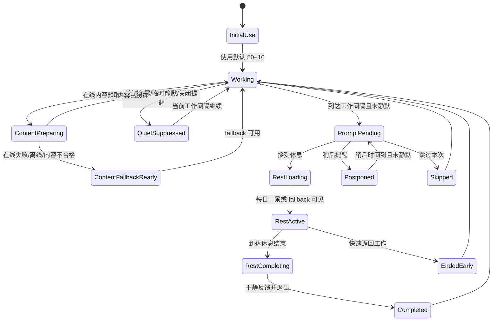

# Quickstart: 美好休息空间 MVP 验证指南

本指南用于在 implementation 阶段验证 Venus MVP 是否满足 spec、plan、数据模型和本地契约。当前阶段不包含完整实现代码；命令会在项目脚手架生成后作为验收基线使用。

## 前置条件

- Windows 10/11 桌面环境。
- Node.js LTS、pnpm 或 npm。
- Rust stable toolchain。
- Tauri 2.x 开发依赖与 Windows WebView2 Runtime。
- 可用耳机或扬声器，用于验证音频状态。
- 至少一个可全屏的应用，用于手动验证全屏静默。
- 可用网络连接，用于验证在线内容源；也需要能断网，用于验证缓存和本地 fallback。

## 推荐开发命令

```powershell
pnpm install
pnpm tauri dev
pnpm test:unit
pnpm test:integration
pnpm test:e2e
cargo test --manifest-path src-tauri/Cargo.toml
```

若 implementation 阶段选择 npm，等价命令为 `npm install`、`npm run tauri:dev`、`npm run test:unit`、`npm run test:integration`、`npm run test:e2e`。

## 核心状态流



## 场景验证

### P1: 分阶段休息邀请

1. 启动应用并使用默认 50 分钟工作 + 10 分钟休息配置。
2. 在测试环境使用 fake timer 或调试开关模拟工作间隔到期。
3. 预期：prompt 以安静、清晰、非惊扰方式出现；接受、稍后、跳过都可在一次明确操作内完成。
4. 选择“稍后提醒”。
5. 预期：prompt 收起，并在 `postponeMinutes` 到达后再次出现。
6. 选择“跳过”。
7. 预期：本工作间隔不再重复打扰，会话状态为 `skipped`。

#### P1 自动化命令

```powershell
npm run test:unit -- src/test/unit/rest-space/cadence-scheduler.test.ts src/test/unit/rest-space/session-state.test.ts
npm run test:integration -- src/test/integration/preferences.persistence.test.ts src/test/integration/desktop-quiet-context.test.ts
npm run build
cargo test --manifest-path src-tauri/Cargo.toml
```

#### P1 手动验收记录

| 检查项 | 记录 |
| --- | --- |
| Windows 版本 |  |
| 显示器数量与缩放比例 |  |
| Venus 启动方式 | `npm run tauri:dev` / release build |
| 默认节奏 | 50 分钟工作 + 10 分钟休息 |
| Prompt 出现方式 |  |
| 接受休息反馈是否 1 秒内可感知 |  |
| 稍后提醒反馈是否 1 秒内可感知 |  |
| 跳过本次反馈是否 1 秒内可感知 |  |
| 全屏应用名称 |  |
| 全屏静默是否未遮挡工作内容 |  |
| `quietSuppressed` reason | `fullscreenDetected` / `temporaryQuiet` / `promptsDisabled` |
| 托盘开始休息事件 |  |
| 托盘暂停/恢复提醒事件 |  |
| 备注 |  |

### P2: 全屏美感休息空间

1. 在有网络环境下启动应用，触发当日内容准备。
2. 预期：在线视觉/音频候选通过授权、主题和质量校验后被缓存。
3. 在 prompt 中选择开始休息。
4. 预期：进入全屏或沉浸窗口，2 秒内显示缓存的每日一景或 polished fallback。
5. 模拟在线 provider 超时、限流、返回缺少授权说明或视觉/音频不匹配。
6. 预期：拒绝不合格内容，显示最近缓存或风格一致的本地 fallback，不出现空白、错误堆栈或突兀占位。
7. 断开网络后再次进入休息空间。
8. 预期：2 秒内显示缓存或本地 fallback，用户无需理解网络状态即可继续休息。
9. 等待休息结束或点击快速返回。
10. 预期：应用给出简短、平静的返回反馈，并退出全屏/沉浸窗口。

### P3: 白噪音与音频控制

1. 在休息空间中开启声音。
2. 预期：1 秒内出现播放状态反馈，声音主题与视觉主题匹配。
3. 调整音量或强度。
4. 预期：变化平滑，无突兀过响或爆音。
5. 点击静音或结束休息。
6. 预期：1 秒内出现可理解状态变化；结束后音频停止或淡出至停止。
7. 断开音频设备或模拟不可用。
8. 预期：出现克制的音频不可用状态，用户仍可无声休息。

### 全屏静默手动验证

1. 打开 PowerPoint、视频播放器或任意可全屏应用。
2. 让 Venus 到达提醒时间。
3. 预期：不遮挡全屏内容，不弹出 prompt，会话记录为 `quietSuppressed`，reason 为 `fullscreenDetected`。
4. 退出全屏后进入下一个可提醒窗口。
5. 预期：Venus 恢复正常提醒能力，不需要重启应用。

## 自动化测试覆盖要求

- Unit tests: cadence 计算、postpone、skip、quiet suppression、session transition、content fallback、audio playback state。
- Integration tests: preference load/save、损坏偏好回退、desktop quiet context、online provider success/failure、content cache、license metadata validation、audio unavailable、Tauri IPC schema validation。
- UI checks: 初次进入、prompt pending、rest loading、rest active、fallback、audio unavailable、completed、ended early。
- Manual checks: Windows 全屏检测、系统托盘、release 构建启动体验、多显示器行为。

## 性能验收

- 休息空间或 fallback 首次可见：正常桌面环境 95% 情况在 2 秒内。
- prompt 接受/稍后/跳过反馈：95% 情况在 1 秒内。
- 音频开始/静音/停止反馈：95% 情况在 1 秒内。
- 全屏静默检测：不得造成鼠标、输入或当前全屏应用可感知卡顿。
- 休息空间运行：目标 60fps，不出现明显闪烁、布局错位、文案遮挡或退出残留。

## 文档与素材检查

- 项目面对团队的文档必须使用中文。
- 休息流程、状态机或架构说明应使用 Mermaid。
- 每个 visual/audio asset 必须记录来源、授权边界和替换规则。
- 在线内容源必须记录 provider、资源标识、授权说明、作者/来源和缓存状态。
- 缺少授权说明、主题不匹配、加载超时或被限流的在线内容不得进入默认每日内容。
- 用户可见语言必须避免医疗化、惩罚式或效率焦虑表达。