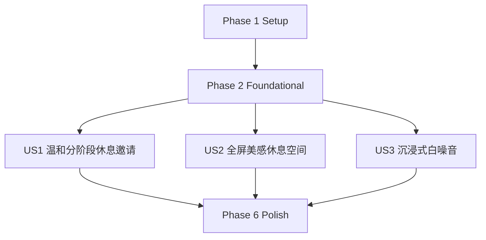

# Tasks: 美好休息空间 MVP

**Input**: Design documents from `/specs/001-beautiful-rest-space/`

**Prerequisites**: plan.md, spec.md, research.md, data-model.md, contracts/local-ipc-events.md, quickstart.md, .specify/memory/constitution.md

**Tests**: Venus 宪法要求行为变更必须包含最窄可执行验证。本任务清单为每个用户故事安排 unit、integration、UI/e2e、性能或手动验收任务；实现前先编写并确认相关测试失败。

**Organization**: Tasks are grouped by independently deliverable user stories. Project-facing task content is written in Chinese.

## Format: `[ID] [P?] [Story] Description`

- **[P]**: 可并行执行，任务修改不同文件且不依赖尚未完成的任务
- **[Story]**: 仅用户故事阶段使用，例如 [US1]、[US2]、[US3]
- 每条任务必须包含明确文件路径

## Path Conventions

- Web UI 与产品状态: `src/`
- 桌面集成与本地 IPC: `src-tauri/`
- 打包 fallback 内容: `public/moments/`
- 测试: `src/test/`
- Feature 文档: `specs/001-beautiful-rest-space/`

---

## Phase 1: Setup (Shared Infrastructure)

**Purpose**: 初始化 Tauri + React + TypeScript + Vite 桌面应用结构、测试命令和 fallback 资源目录。

- [X] T001 在 package.json 初始化 Venus 桌面应用脚本、依赖和测试命令
- [X] T002 在 pnpm-lock.yaml 或 package-lock.json 固定前端依赖版本
- [X] T003 在 src/main.tsx 创建 React 应用入口
- [X] T004 [P] 在 src/app/App.tsx 创建应用根组件占位
- [X] T005 [P] 在 src/features/rest-space/ 创建 cadence、session、content、audio、preferences、components 子目录
- [X] T006 在 src-tauri/Cargo.toml 初始化 Tauri 2.x Rust 项目依赖
- [X] T007 在 src-tauri/tauri.conf.json 配置 Windows-first Tauri 应用窗口与构建输出
- [X] T008 [P] 在 vitest.config.ts 和 src/test/setup.ts 配置 Vitest、React Testing Library 与 fake timer 基线
- [X] T009 [P] 在 playwright.config.ts 和 src/test/e2e/ 配置 Playwright 桌面 WebView UI 检查基线
- [X] T010 [P] 在 public/moments/fallback.json、public/moments/images/、public/moments/audio/ 建立打包 fallback manifest 和资源目录占位

---

## Phase 2: Foundational (Blocking Prerequisites)

**Purpose**: 建立所有用户故事共享的类型、事件、IPC schema、偏好默认值、性能标记和视觉语言基础。

**CRITICAL**: 本阶段完成前不得开始任一用户故事实现。

- [X] T011 [P] 在 src/features/rest-space/shared/types.ts 定义 Result、RecoverableError、DateKey 和 SourceMetadata 共享类型
- [X] T012 [P] 在 src/shared/events/domain-events.ts 定义 rest、audio、desktop TypeScript 事件名称和 payload 基础类型
- [X] T013 [P] 在 src/shared/time/clock.ts 实现可注入 Clock 接口和测试 fake clock 适配
- [X] T014 在 src/features/rest-space/preferences/defaults.ts 定义默认 50+10 节奏、音频偏好、prompt 开关和 schemaVersion
- [X] T015 在 src/features/rest-space/desktop/ipc-schema.ts 定义 preferences、window、desktop、content Tauri command 输入输出 schema
- [X] T016 [P] 在 src/features/rest-space/desktop/ipc-client.ts 创建类型化 invoke/listen 薄封装
- [X] T017 [P] 在 src-tauri/src/commands.rs 创建 preferences、window、desktop、content command 模块入口
- [X] T018 [P] 在 src-tauri/src/main.rs 注册 Tauri command handler、事件和插件入口
- [X] T019 [P] 在 src-tauri/capabilities/default.json 配置最小 IPC 能力与本地文件访问范围
- [X] T020 [P] 依据 specs/001-beautiful-rest-space/design-direction.md 在 src/app/styles/tokens.css 定义轻、静、美的颜色、排版、间距和动效 token
- [X] T021 [P] 在 src/shared/performance/marks.ts 定义 prompt、rest-space、audio、quiet-check 性能标记工具
- [X] T022 在 src/test/integration/ipc-schema.test.ts 验证本地 IPC schema 不包含窗口标题、会议内容或工作文本字段

**Checkpoint**: Foundation ready - user story implementation can now begin in parallel.

---

## Phase 3: User Story 1 - 在工作间隔中收到温和的分阶段休息邀请 (Priority: P1) MVP

**Goal**: 用户无需配置即可体验默认 50 分钟工作 + 10 分钟休息节奏，能接受、稍后、跳过、结束休息，并在全屏工作场景自动静默。

**Independent Test**: 使用 fake timer 模拟一次工作间隔到期，验证 prompt 出现、接受、稍后、跳过、全屏静默和完成/提前结束路径均可独立运行。

### Tests for User Story 1

> 先编写这些测试并确认失败，再实现 US1。

- [X] T023 [P] [US1] 在 src/test/unit/rest-space/cadence-scheduler.test.ts 覆盖默认 50+10、postponeMinutes 和 promptsEnabled=false 行为
- [X] T024 [P] [US1] 在 src/test/unit/rest-space/session-state.test.ts 覆盖 working、promptPending、postponed、skipped、quietSuppressed、completed、endedEarly 状态流转
- [X] T025 [P] [US1] 在 src/test/integration/preferences.persistence.test.ts 覆盖 preferences.load/save、损坏偏好回退和无 schema 偏好迁移
- [X] T026 [P] [US1] 在 src/test/integration/desktop-quiet-context.test.ts 覆盖 desktop.getQuietContext 全屏静默、不返回敏感文本和 promptsDisabled 路径
- [X] T027 [P] [US1] 在 src/test/e2e/us1-rest-prompt.spec.ts 覆盖初次进入、prompt pending、接受、稍后、跳过和结束休息 UI journey
- [X] T028 [US1] 在 src/test/e2e/us1-prompt-performance.spec.ts 验证 prompt 接受、稍后、跳过反馈 95% 情况 1 秒内完成

### Implementation for User Story 1

- [X] T029 [P] [US1] 在 src/features/rest-space/cadence/types.ts 实现 RestCadence 类型、校验范围和 suggestionMode 默认值
- [X] T030 [US1] 在 src/features/rest-space/cadence/scheduler.ts 实现基于 Clock 的工作间隔、稍后提醒和 prompt due 计算
- [X] T031 [P] [US1] 在 src/features/rest-space/session/types.ts 实现 RestSession、RestStage、RestSessionState 和 selectedAction 类型
- [X] T032 [US1] 在 src/features/rest-space/session/state-machine.ts 实现 US1 所需 session 状态机和非法流转保护
- [X] T033 [US1] 在 src/features/rest-space/preferences/store.ts 实现 TypeScript 偏好读取、默认回退、保存失败恢复和当前会话不阻塞逻辑
- [X] T034 [US1] 在 src-tauri/src/preferences.rs 实现本地 JSON/key-value 偏好 load/save、schema 校验和损坏文件回退
- [X] T035 [US1] 在 src-tauri/src/fullscreen.rs 实现 Windows 全屏检测的轻量查询函数且不采集窗口标题
- [X] T036 [US1] 在 src-tauri/src/commands.rs 接入 preferences.load、preferences.save 和 desktop.getQuietContext 命令
- [X] T037 [P] [US1] 在 src/features/rest-space/components/RestPrompt.tsx 创建温和 prompt 组件，包含开始、稍后、跳过操作
- [X] T038 [P] [US1] 在 src/features/rest-space/components/CadenceStatus.tsx 创建初次进入、工作中、稍后、跳过、已完成状态展示
- [X] T039 [US1] 在 src/features/rest-space/session/useRestSessionController.ts 集成 scheduler、quiet context、preferences 和 prompt actions
- [X] T040 [US1] 在 src/app/App.tsx 挂载 US1 控制器、prompt 入口和偏好加载状态
- [X] T041 [P] [US1] 在 src-tauri/src/tray.rs 实现系统托盘 pausePrompts、resumePrompts、startRest 事件骨架
- [X] T042 [US1] 在 specs/001-beautiful-rest-space/quickstart.md 补充 US1 自动化命令、全屏静默手动验收记录字段和接受标准

**Checkpoint**: US1 可独立演示：默认节奏、温和提醒、稍后、跳过、全屏静默、结束路径均可验证。

---

## Phase 4: User Story 2 - 在休息中进入轻量美感空间 (Priority: P2)

**Goal**: 用户接受休息后进入全屏沉浸休息空间，2 秒内看到每日一景、缓存内容或本地 fallback；在线内容必须校验授权、质量和视听匹配。

**Independent Test**: 通过一次 1-5 分钟休息验证全屏打开、每日一景、在线 provider 成功、provider 失败、缓存命中、本地 fallback、返回工作和 UX 状态完整性。

### Tests for User Story 2

> 先编写这些测试并确认失败，再实现 US2。

- [X] T043 [P] [US2] 在 src/test/unit/rest-space/content-provider.test.ts 覆盖 provider candidate 授权缺失、分辨率不足、主题不匹配和限流失败拒绝规则
- [X] T044 [P] [US2] 在 src/test/unit/rest-space/daily-moment-selector.test.ts 覆盖 online、cache、bundledFallback 的每日一景选择优先级
- [X] T045 [P] [US2] 在 src/test/integration/content-cache.test.ts 覆盖 content.cacheAsset 成功、network_failed、license_missing、write_failed 和缓存索引状态
- [X] T046 [P] [US2] 在 src/test/integration/window-fullscreen.test.ts 覆盖 window.enterRestFullscreen 失败时回落沉浸窗口且不空白
- [X] T047 [P] [US2] 在 src/test/e2e/us2-rest-space.spec.ts 覆盖 rest loading、rest active、fallback、completed、endedEarly、鼠标/键盘/临近结束触发控制项浮现和返回工作 UI journey
- [X] T048 [US2] 在 src/test/e2e/us2-rest-space-performance.spec.ts 验证 daily moment 或 polished fallback 95% 情况 2 秒内可见

### Implementation for User Story 2

- [X] T049 [P] [US2] 在 src/features/rest-space/content/types.ts 实现 VisualMoment、AudioMoment 内容元数据、ContentCacheEntry 和 ProviderCandidate 类型，作为视觉/音频素材来源与匹配信息的唯一数据模型
- [X] T050 [US2] 在 src/features/rest-space/content/provider.ts 实现可替换 ContentProvider 接口和 provider 超时/限流错误模型
- [X] T051 [US2] 在 src/features/rest-space/content/validation.ts 实现授权说明、来源、分辨率、主题和视听匹配校验
- [X] T052 [US2] 在 src/features/rest-space/content/dailyMomentSelector.ts 实现 online candidate、缓存和 bundled fallback 的选择策略
- [X] T053 [US2] 在 src/features/rest-space/content/cacheIndex.ts 实现缓存索引读取、过期处理、fallbackId 关联和不可删除 bundled fallback 规则
- [X] T054 [US2] 在 src-tauri/src/content_cache.rs 实现 content.cacheAsset 下载、格式错误、授权缺失和写入失败的可恢复返回
- [X] T055 [US2] 在 src-tauri/src/commands.rs 接入 content.cacheAsset、window.enterRestFullscreen 和 window.exitRestFullscreen 命令
- [X] T056 [US2] 在 src-tauri/src/window.rs 实现进入全屏、退出全屏和失败回落沉浸窗口逻辑
- [X] T057 [P] [US2] 在 public/moments/fallback.json 填写本地 fallback visual/audio 元数据、licenseNote、attribution 和匹配主题
- [X] T058 [P] [US2] 在 src/features/rest-space/components/RestSpace.tsx 创建全屏休息空间布局、每日一景展示和快速返回入口
- [X] T059 [P] [US2] 在 src/features/rest-space/components/RestContentStates.tsx 创建 loading、ready、fallback、unavailable、online unavailable 状态
- [X] T060 [US2] 在 src/features/rest-space/session/useRestSessionController.ts 接入 restLoading、restActive、restCompleting、completed、endedEarly 路径
- [X] T061 [US2] 在 src/features/rest-space/content/useDailyMoment.ts 实现休息前预取、缓存命中、provider 失败和本地 fallback 组合
- [X] T062 [US2] 在 src/app/styles/rest-space.css 实现全屏视觉、图片呼吸动效、Space 切图 crossfade、鼠标/键盘/状态变化/临近结束触发的低存在感控制项浮现、防遮挡布局和 60fps 友好动效
- [X] T063 [US2] 在 specs/001-beautiful-rest-space/quickstart.md 补充在线 provider、断网、缓存命中、本地 fallback 和授权记录验收步骤

**Checkpoint**: US2 可独立演示：接受休息后进入美感空间，在线内容、缓存和 fallback 都能在 2 秒预算内给出完整体验。

---

## Phase 5: User Story 3 - 用沉浸式白噪音辅助短暂恢复 (Priority: P3)

**Goal**: 用户在休息空间内可选开启匹配视觉主题的白噪音/环境声，能快速调节、静音、停止，并在设备不可用时无声继续休息。US3 第一版使用本地 bundled soundscape 保证稳定体验，同时预留可替换 AudioProvider；后续在线音频优先实验 Wikimedia Commons Audio，无私有 token，长期高质量来源可接 Freesound proxy。

**Independent Test**: 在休息空间中开启声音、调整强度、静音、断开设备并结束休息，验证音频状态反馈 1 秒内可感知且退出后无残留播放。

### Tests for User Story 3

> 先编写这些测试并确认失败，再实现 US3。

- [ ] T064 [P] [US3] 在 src/test/unit/rest-space/audio-state.test.ts 覆盖 off、loading、playing、muted、unavailable、fadingOut 状态流转
- [ ] T065 [P] [US3] 在 src/test/unit/rest-space/audio-matching.test.ts 覆盖 VisualMoment theme 到 forest/water/rain/air/night soundscape 的映射、同类切图不换声源、跨类切图延迟 crossfade 和 silenceFallback 降级
- [ ] T066 [P] [US3] 在 src/test/integration/audio-device.test.ts 覆盖设备不可用、本地 bundled soundscape 命中、在线音频 provider 不可用、缓存音频命中和结束播放停止
- [ ] T067 [P] [US3] 在 src/test/e2e/us3-audio-controls.spec.ts 覆盖开启、音量/强度调整、静音、结束休息和无声继续 UI journey
- [ ] T068 [US3] 在 src/test/e2e/us3-audio-performance.spec.ts 验证音频开始、静音、停止反馈 95% 情况 1 秒内完成

### Implementation for User Story 3

- [ ] T069 [P] [US3] 在 src/features/rest-space/audio/types.ts 从 src/features/rest-space/content/types.ts 引用 AudioMoment，并实现 Soundscape、PlaybackState、VolumePreference、AudioUnavailableReason 和 AudioProviderCandidate 类型
- [ ] T070 [US3] 在 src/features/rest-space/audio/audioController.ts 实现播放、平滑音量/强度变化、静音、800ms 退出淡出、2s 跨 soundscape crossfade 和结束停止逻辑
- [ ] T071 [US3] 在 src/features/rest-space/audio/audioMatcher.ts 实现 visual theme 到 forest/water/rain/air/night soundscape 的匹配、同类视觉切换保持当前音频、跨类视觉切换延迟 800-1200ms 后切换和 silenceFallback 降级
- [ ] T072 [US3] 在 src/features/rest-space/audio/useRestAudio.ts 集成用户偏好、bundledSoundscapeProvider、缓存音频、设备不可用和 playbackStateChanged 事件
- [ ] T072a [US3] 在 src/features/rest-space/audio/provider.ts 定义可替换 AudioProvider 接口，并记录 US3 首版默认 bundled soundscape；Wikimedia Commons Audio 作为无 key 后续实验 provider，Freesound 仅允许通过 proxy/serverless 接入且不得在桌面端硬编码 token
- [ ] T073 [P] [US3] 在 src/features/rest-space/components/AudioControls.tsx 创建声音开启、静音、音量/强度控制和不可用状态
- [ ] T074 [US3] 在 src/features/rest-space/components/RestSpace.tsx 集成 AudioControls 且保留最少控制项和快速退出入口
- [ ] T075 [US3] 在 src/features/rest-space/preferences/store.ts 持久化 audioEnabledByDefault、lastVolume 和音频偏好恢复逻辑
- [ ] T076 [US3] 在 specs/001-beautiful-rest-space/quickstart.md 补充耳机、设备断开、本地 bundled soundscape、在线音频失败、图片切换后的音频保持/crossfade 和结束淡出手动验收步骤

**Checkpoint**: US3 可独立演示：声音体验与视觉匹配、可控、可静音、可恢复，结束后无残留音频。

---

## Phase 6: Polish & Cross-Cutting Concerns

**Purpose**: 补齐跨故事质量、性能、文档、素材授权、UX 一致性和发布前验证。

- [ ] T077 [P] 在 src/test/e2e/mvp-full-cycle.spec.ts 覆盖 prompt 到 rest space 到 return 的完整 MVP 流程
- [ ] T078 [P] 在 src/test/integration/performance-budget.test.ts 汇总 prompt 1 秒、rest space 2 秒、audio 1 秒性能标记断言
- [ ] T079 在 specs/001-beautiful-rest-space/quickstart.md 增加 Mermaid 最终实现状态图、Windows 版本、显示器、网络和音频设备验收记录模板
- [ ] T080 [P] 在 docs/content-sources.md 记录在线 provider、授权边界、缓存策略、fallback 替换规则和禁止硬编码私密 API key 约束
- [ ] T081 [P] 在 docs/ux-language.md 记录 Venus 用户可见文案原则，避免医疗化、惩罚式和效率焦虑表达
- [ ] T082 对照 specs/001-beautiful-rest-space/design-direction.md 在 src/app/styles/tokens.css 和 src/app/styles/rest-space.css 完成 UX 一致性检查，覆盖 loading、empty、error、success、disabled、responsive 状态，并确认未采用营销首页、卡片墙、教程优先、大面积紫蓝渐变、过度玻璃拟态或霓虹默认主题
- [ ] T083 在 src-tauri/src/fullscreen.rs 和 src-tauri/src/content_cache.rs 完成安全检查，确认不记录敏感工作内容、provider token 或窗口标题
- [ ] T084 在 specs/001-beautiful-rest-space/quickstart.md 记录自动化测试、cargo test、Playwright、全屏静默手动验证和 release smoke check 的最终结果

---

## Dependencies & Execution Order

### Phase Dependencies

- **Setup (Phase 1)**: 无依赖，可立即开始。
- **Foundational (Phase 2)**: 依赖 Setup 完成，阻塞所有用户故事。
- **User Stories (Phase 3+)**: 均依赖 Foundational 完成，可按 P1 → P2 → P3 顺序交付，也可在人员足够时并行推进。
- **Polish (Phase 6)**: 依赖计划纳入发布的用户故事完成。

### User Story Dependencies

- **User Story 1 (P1)**: 仅依赖 Foundation，是 MVP 建议范围。
- **User Story 2 (P2)**: 依赖 Foundation；可独立验证休息空间，但实际产品入口会复用 US1 的 session controller。
- **User Story 3 (P3)**: 依赖 Foundation；可在 RestSpace 内独立验证音频控制，完整体验建议在 US2 后集成。

### Dependency Graph



### Within Each User Story

- 先写测试并确认失败，再实现对应故事。
- 类型和模型先于 service/controller。
- TypeScript 产品状态先于 Tauri 命令集成。
- 核心行为先于 UI polish。
- 每个故事完成后按 quickstart 独立验证，再进入下一优先级。

---

## Parallel Opportunities

- Setup 中 `src/`、`src-tauri/`、测试配置和 fallback 资源目录可并行。
- Foundational 中共享类型、事件、Clock、IPC client、Rust command 骨架、CSS token 和性能标记可并行。
- Foundation 完成后，US1、US2、US3 可由不同开发者并行推进；若单人推进，建议按 P1 → P2 → P3。
- 每个用户故事的 unit、integration、e2e 测试任务可并行编写。
- 每个故事中不同文件的组件、类型和 Rust 模块任务可并行。

## Parallel Example: User Story 1

```text
Task: "T023 [P] [US1] 在 src/test/unit/rest-space/cadence-scheduler.test.ts 覆盖默认 50+10、postponeMinutes 和 promptsEnabled=false 行为"
Task: "T024 [P] [US1] 在 src/test/unit/rest-space/session-state.test.ts 覆盖 working、promptPending、postponed、skipped、quietSuppressed、completed、endedEarly 状态流转"
Task: "T026 [P] [US1] 在 src/test/integration/desktop-quiet-context.test.ts 覆盖 desktop.getQuietContext 全屏静默、不返回敏感文本和 promptsDisabled 路径"
Task: "T037 [P] [US1] 在 src/features/rest-space/components/RestPrompt.tsx 创建温和 prompt 组件，包含开始、稍后、跳过操作"
```

## Parallel Example: User Story 2

```text
Task: "T043 [P] [US2] 在 src/test/unit/rest-space/content-provider.test.ts 覆盖 provider candidate 授权缺失、分辨率不足、主题不匹配和限流失败拒绝规则"
Task: "T044 [P] [US2] 在 src/test/unit/rest-space/daily-moment-selector.test.ts 覆盖 online、cache、bundledFallback 的每日一景选择优先级"
Task: "T057 [P] [US2] 在 public/moments/fallback.json 填写本地 fallback visual/audio 元数据、licenseNote、attribution 和匹配主题"
Task: "T058 [P] [US2] 在 src/features/rest-space/components/RestSpace.tsx 创建全屏休息空间布局、每日一景展示和快速返回入口"
```

## Parallel Example: User Story 3

```text
Task: "T064 [P] [US3] 在 src/test/unit/rest-space/audio-state.test.ts 覆盖 off、loading、playing、muted、unavailable、fadingOut 状态流转"
Task: "T065 [P] [US3] 在 src/test/unit/rest-space/audio-matching.test.ts 覆盖 AudioMoment 与 VisualMoment theme 匹配和 silenceFallback 降级"
Task: "T069 [P] [US3] 在 src/features/rest-space/audio/types.ts 从 src/features/rest-space/content/types.ts 引用 AudioMoment，并仅实现 PlaybackState、VolumePreference 和 AudioUnavailableReason 播放态类型"
Task: "T073 [P] [US3] 在 src/features/rest-space/components/AudioControls.tsx 创建声音开启、静音、音量/强度控制和不可用状态"
```

---

## Implementation Strategy

### MVP First (User Story 1 Only)

1. Complete Phase 1: Setup
2. Complete Phase 2: Foundational
3. Complete Phase 3: User Story 1
4. STOP and VALIDATE: 运行 US1 unit、integration、e2e、prompt 性能检查和全屏静默手动验收
5. Demo MVP prompt flow，再决定是否进入 US2

### Incremental Delivery

1. Setup + Foundational → 形成可测试应用骨架
2. US1 → 验证温和提醒、全屏静默和本地偏好
3. US2 → 验证全屏美感空间、在线内容、缓存和 fallback
4. US3 → 验证白噪音、音频控制和设备不可用恢复
5. Polish → 汇总完整 MVP 流程、性能预算、文档和授权记录

### Parallel Team Strategy

1. 团队先共同完成 Setup + Foundational。
2. Foundation 完成后：开发者 A 负责 US1 cadence/session/preferences，开发者 B 负责 US2 content/fullscreen/fallback，开发者 C 负责 US3 audio controls。
3. 每个故事独立通过测试和 quickstart 验收后再合并到完整 MVP 流程。

---

## Notes

- [P] 任务代表可并行，不代表必须并行。
- [US1]、[US2]、[US3] 与 spec.md 中的用户故事优先级一一对应。
- 所有故事都包含行为验证任务，因为 Venus 宪法要求测试证明行为。
- 全屏检测、系统托盘、多显示器和真实音频设备属于 OS 级风险，自动化不足时必须在 quickstart.md 记录手动验证环境与结果。
- 在线内容不得硬编码私密 API key；所有使用的 visual/audio 资源必须记录来源、授权说明、匹配元数据和 fallback 路径。