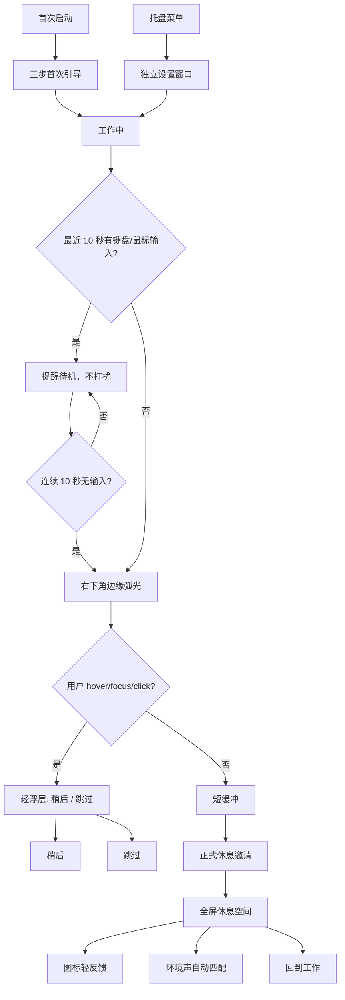

# Design Direction: Venus 下一轮迭代

## 设计立场

002 迭代的设计目标不是增加更多提醒，而是让 Venus 更懂边界。MVP 已经证明“温和提醒 -> 全屏美感休息空间 -> 回到工作”的闭环可用；下一轮要补齐的是日常使用中的合时宜、可调校和可信任。

002 继续继承 MVP 的“沉浸式自然感 + 桌面级克制交互”。新增 UI 必须服务休息空间，而不是把 Venus 推向传统设置繁重的提醒工具、健康打卡产品或效率仪表盘。

核心判断：

- 提醒不是打断，而是等待合适时机后的邀请。
- 预告不是通知，而是环境里轻微变化。
- 设置不是控制台，而是少量高价值偏好。
- 偏好不是内容库，而是让每日一景逐渐贴近用户。
- 声音不是播放器，而是与画面同步的氛围层。

## 体验结构



图片占位：后续 UI 设计稿或截图应补在以下位置。

```text
specs/002-next-iteration-discovery/images/onboarding-flow.png
specs/002-next-iteration-discovery/images/settings-window.png
specs/002-next-iteration-discovery/images/edge-glow.png
specs/002-next-iteration-discovery/images/rest-feedback-icons.png
```

## 右下角边缘弧光

### 角色

右下角边缘弧光是完整休息前的纯视觉预告。它的目标是让用户感知“休息快到了”，但不要求用户立刻处理。

弧光不是 toast、不是弹窗、不是系统通知，也不是小号 prompt。

### 默认状态

- 位置：主屏右下角边缘，接近托盘语义，但不依附 Windows toast。
- 形态：边缘弧光，不出现卡片、不出现文字、不出现图标。
- 亮度：低亮度，柔和，不能像警告、游戏 HUD 或系统异常。
- 范围：只占右下角边缘局部，不做四边全屏框线。
- 动效：6-8 秒呼吸后淡出。
- 声音：无声音、无震动、无任务栏闪烁、无托盘气泡。
- 焦点：不抢焦点，不进入任务栏，不阻塞输入。

### 交互展开

用户 hover、focus 或 click 弧光区域后，可展开小型轻浮层。

轻浮层只包含：

- 状态文案：休息快到了
- 操作：稍后
- 操作：跳过

轻浮层不得包含：

- 开始休息
- 设置入口
- 倒计时压力文案
- 健康风险说明
- 声音或内容控制

### 心流保护

- 最近 10 秒内有键盘或鼠标输入时，不显示弧光。
- 正式 prompt 到期时如果用户仍 active，也不显示 prompt。
- 用户进入安静窗口后，先显示弧光；若 30 秒内仍安静，再显示正式 prompt。
- ActiveFlow 阈值不暴露给用户配置。
- 全屏、演示或 reduced motion 场景下必须静默或降级。

## 设置窗口

### 结构

设置窗口是独立窗口，由托盘菜单的“设置...”打开。托盘只作为入口，不承载复杂配置。

设置窗口建议分为五组：

1. 休息节奏
2. 提醒方式
3. 内容偏好
4. 环境声
5. 隐私与数据

### 行为

- 设置即时保存，不提供统一“保存/取消”按钮。
- 需要提供恢复默认。
- 如果设置窗口已打开，再次从托盘打开时聚焦已有窗口。
- 关闭设置窗口不退出 Venus。
- 设置窗口不应像 dashboard，不展示统计、趋势、完成率或连续天数。

### 视觉密度

设置窗口应比休息空间更清晰、更实用，但仍保持安静。

- 使用分组、开关、分段控件、少量说明文案。
- 不使用卡片墙、营销式功能介绍或复杂 hero。
- 不使用大面积紫蓝渐变、霓虹、夸张玻璃拟态或装饰光球。
- 控件尺寸稳定，文字不挤压，不因切换状态造成布局跳动。

## 首次引导

首次引导只做必要调校，不做完整设置向导。它写入同一份偏好模型，但 UI 必须比设置窗口更轻。

三步结构：

1. **休息节奏**: 默认 50+10，并提供 25+5、75+10 与稍后调整。
2. **内容偏好**: 选择少量喜欢的方向，例如自然风光、水面与雨、森林与草地、天空与宇宙、人文街景、动物与陪伴。
3. **弧光提醒说明**: 说明右下角边缘弧光无声、不抢焦点、持续输入时不会出现，并提供关闭入口。

首次引导不放：

- 环境声自动开启开关。
- 工作时间复杂编辑器。
- 隐私细项配置。
- 统计、趋势或 agent memory 说明。

首次引导中的工作时间策略：默认不限制；可轻量建议“工作日 09:00-18:00”或稍后在设置中配置。

## 内容偏好

内容偏好用于排序合法候选，不绕过授权、质量和 fallback 校验。

主题建议：

- 自然风光
- 水面与雨
- 森林与草地
- 天空与宇宙
- 城市与建筑
- 人文街景
- 动物与陪伴
- 艺术与纹理

“动物与陪伴”必须保持克制：允许安静、柔和、低刺激、非表情包化的动物内容；避免搞笑、夸张表情、短视频感、宠物商品图和强娱乐化内容。

## 休息空间轻反馈

休息空间中的反馈入口必须保持图标化和低存在感。

建议图标：

- Heart: 喜欢这类
- MinusCircle: 少来点这类

交互规则：

- 默认随休息空间控制项低存在感出现。
- 图标按钮不直接显示文字。
- 必须提供 tooltip 和 aria-label。
- 点击“喜欢这类”只记录偏好，不切换当前画面。
- 点击“少来点这类”记录降权信号，并切换到下一张画面。
- 不显示“已学习你的偏好”这类重反馈。
- 不进入收藏夹、素材库或管理面板。

## 环境声

环境声是画面的氛围层，不是播放器。

002 只做少量高质量预设，不做混音台、playlist、声音库或 Focus/Relax/Wind Down 场景。

建议预设：

- 森林
- 水声
- 雨声
- 风声
- 夜晚
- 安静空气

自动匹配规则：

| 图片主题 | 默认声音 |
| --- | --- |
| 自然风光 / 森林与草地 | 森林 |
| 水面与雨 | 水声或雨声 |
| 天空与宇宙 | 风声或夜晚 |
| 城市与建筑 | 安静空气 |
| 人文街景 | 安静空气 |
| 动物与陪伴 | 森林或安静空气 |
| 艺术与纹理 | 安静空气 |

行为规则：

- 环境声默认关闭。
- 自动开启开关只放设置窗口，不放首次引导。
- 用户开启自动匹配时，图片跨类切换后约 1 秒 crossfade。
- 同类图片切换不打断当前声音。
- 用户手动静音后不得自动恢复声音。
- 设备不可用时继续无声休息。

## 隐私与数据

“隐私与数据”页的设计目标是建立信任，而不是展示技术细节。

必须包含：

- 本地数据说明。
- 清除内容缓存。
- 清除偏好与设置。
- 关闭偏好学习。

不得包含：

- 导入/导出。
- 事件日志浏览。
- 高级调试。
- agent memory 或 `soul.md` 写入。
- weekly summary、连续天数、健康评分、效率评价。

## 文案语气

继续使用平静、短句、个人化表达。

推荐表达：

- 休息快到了
- 稍后
- 跳过
- 喜欢这类
- 少来点这类
- 进入休息空间时自动开启环境声
- 清除内容缓存
- 关闭偏好学习

避免表达：

- 你必须休息
- 保护健康风险
- 完成今日休息目标
- 连续打卡
- 提升效率
- Focus / Relax / Wind Down / Sleep
- 智能诊断你的工作状态

## 验收标准

- 用户能在首次引导后理解右下角弧光含义，但弧光本体不需要文字解释。
- 用户处于连续输入时，不出现弧光或正式 prompt。
- 用户能在 2 分钟内找到设置窗口并调整休息节奏、内容偏好和环境声偏好。
- 设置窗口不被用户描述为 dashboard、控制台或复杂配置页。
- 休息空间轻反馈不破坏全屏内容的安静感。
- 环境声与图片主题不出现明显情绪冲突。
- 002 评估中少于 20% 用户认为 Venus 比 MVP 更打扰、更工具化或更像健康/效率产品。